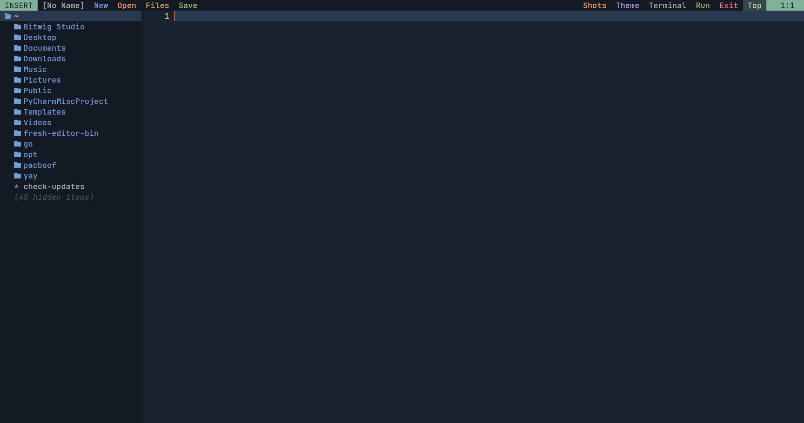

# EasyVim

> **A lightweight, modern IDE experience built on Neovim where common shortcuts just work.**

EasyVim bridges the gap between the intuition of VS Code and the raw performance of the terminal.


---

## Highlights

- **Zero Learning Curve**: `Ctrl+S`, `Ctrl+C`, `Ctrl+V`, `Ctrl+Z` work instantly
- **Blazing Fast**: Startup in under 50ms, runs on ~25MB RAM
- **Battery Included**: File Explorer, Terminal, Themes, and Auto-Language Support

---

## Quick Start

```bash
git clone https://github.com/benevolentshrine/easyvim.git
cd easyvim
./install.sh
```

*Restart your terminal and run `nvim` to start*

---

## Shortcuts

| Key | Action |
| :--- | :--- |
| **Ctrl+S** | Save File |
| **Ctrl+O** | Open Folder |
| **Ctrl+C** | Copy / Stop Code |
| **Ctrl+V** | Paste |
| **Ctrl+Z** | Undo |
| **Ctrl+F** | Find File |
| **Ctrl+H** | Search Text |
| **Ctrl+B** | Toggle Sidebar |
| **Ctrl+\\** | Toggle Terminal |
| **F5** | Run Code |


---

## Features

### File Explorer
Press **Ctrl+B** to toggle. Use **a** (add), **d** (delete), **r** (rename), **c** (copy), **m** (move).



### Integrated Terminal
Press **Ctrl+\\** to toggle. Press **F5** to run your code.


---

## Themes

Switch themes with the **Theme** button in the top bar.

| Rose Pine | Nord | Everforest |
|:-:|:-:|:-:|
|  |  |  |

| One Dark | Nightfox |
|:-:|:-:|
|  |  |

---

## License

MIT License © 2026 benevolentshrine
