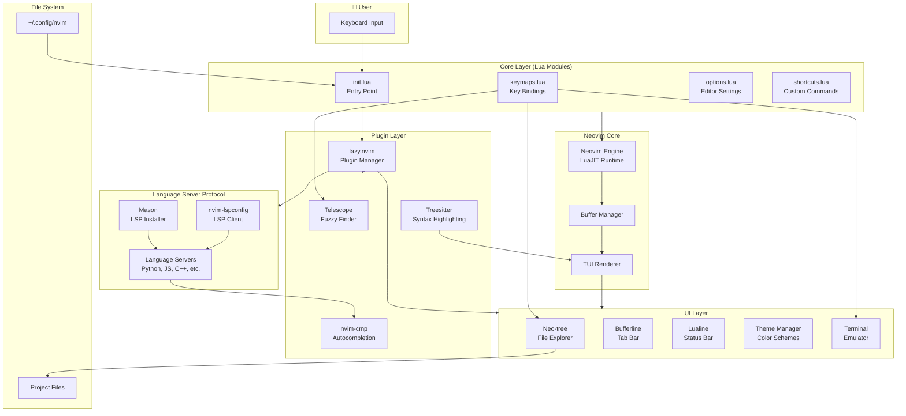

# TEMPLATE 7: Initial System Architecture Template

**Project Title:** EasyVim: The Zero-Friction Neovim config.  
**Team ID / Members:** SY1901 / Hrishikesh Kulkarni, Harsh Singh, Lucky, Sayan Ghoshal

---

## 1. Architecture Diagram



---

## 2. Brief Explanation

### How the components interact:

1. **User Input → Core Layer**  
   When the user presses a key (like Ctrl+S), Neovim sends it to `init.lua`, which loads all our configuration modules.

2. **Core Layer → Plugin Manager**  
   `init.lua` initializes `lazy.nvim` (plugin manager), which then loads all plugins on demand (lazy loading for fast startup).

3. **Plugin Layer → UI Components**  
   Plugins like Neo-tree, Bufferline, and Lualine create the visual interface. Treesitter parses code for syntax colors.

4. **LSP Integration**  
   Mason installs language servers (Python, JavaScript, etc.). `nvim-lspconfig` connects Neovim to these servers. `nvim-cmp` uses LSP data to show autocompletion suggestions.

5. **Neovim Engine**  
   The Neovim core (written in C with LuaJIT) handles buffer management, text editing, and renders everything to the terminal.

6. **File System**  
   Configuration files live in `~/.config/nvim/`. The file explorer (Neo-tree) reads and writes to the user's project directory.

---

### Data Flow Summary

```
User Input → init.lua → lazy.nvim → Plugins → Neovim Engine → Terminal Output
                                  ↓
                           Language Servers → Autocompletion/Diagnostics
```

---

## Key Design Decisions

| Decision | Reason |
| :--- | :--- |
| **Lua-based configuration** | Faster than Vimscript; easier to maintain and extend. |
| **Lazy loading plugins** | Keeps startup time under 50ms by loading plugins only when needed. |
| **Mason for LSP** | Automates language server installation; works across Linux/macOS. |
| **Modular file structure** | Separates keymaps, options, and plugins for easier debugging. |
